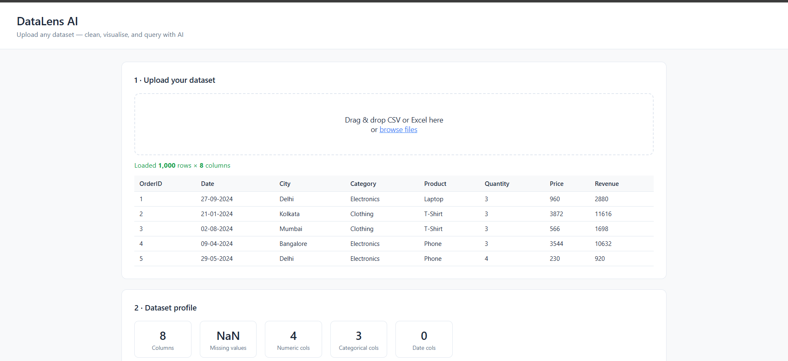
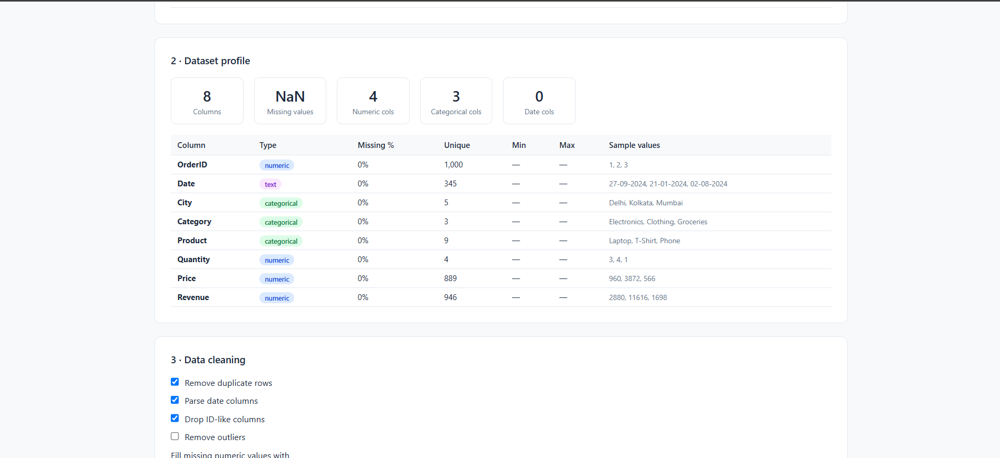
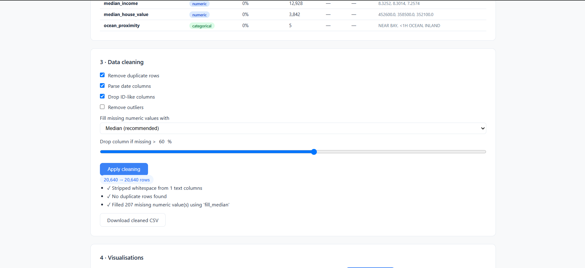
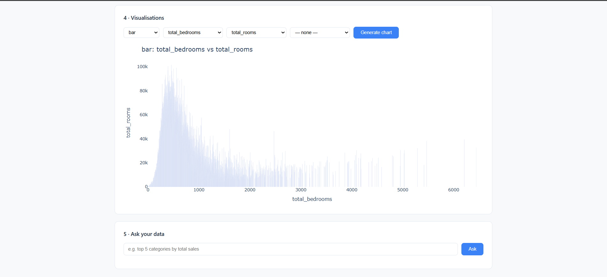
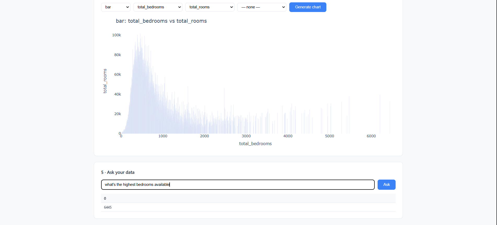

# 🤖 AI-Powered Dashboard

A web dashboard that lets you upload CSV data, explore it visually through charts, and ask questions about your data in plain English — powered by Google's Gemini AI.

---

## 📸 Preview

> Upload → Profile → Clean → Visualize → Ask



---

## ✨ What It Does

### 1 · Upload your dataset
Drag and drop any CSV file and instantly see a preview of your data.


### 2 · Dataset profile
Get an automatic summary — column types, missing values, unique counts, and sample values.



### 3 · Data cleaning
Choose what to clean: remove duplicates, parse dates, fill missing values, drop outliers — then download the cleaned CSV.



### 4 · Visualizations
Pick chart type, X axis, and Y axis, then hit **Generate chart** to explore your data visually.



### 5 · Ask your data
Type a plain English question and get an instant answer — no SQL or Python needed.



---

## 🗂️ Project Structure

```
AI-POWERED-DASHBOARD/
├── app.py                  # Main app — runs the server and routes
├── requirements.txt        # Python dependencies
├── Dockerfile              # For running in a container
├── data/                   # Sample datasets (e.g. superstore.csv)
├── templates/              # HTML page templates
├── static/
│   ├── css/                # Stylesheets
│   └── js/                 # Chart rendering, uploader, NL query UI
├── uploads/                # Cleaned CSV files saved here
├── utils/
│   ├── loader.py           # Reads CSV files into DataFrames
│   ├── cleaner.py          # Cleans and standardizes uploaded data
│   ├── charts.py           # Builds chart-ready data structures
│   ├── profiler.py         # Summarizes DataFrame stats
│   └── nl_query.py         # Natural language → pandas query (uses Gemini)
└── tests/
    ├── test_cleaner.py
    └── test_routes.py
```

---

## 🚀 Getting Started

### 1. Clone the repo

```bash
git clone https://github.com/your-username/ai-powered-dashboard.git
cd ai-powered-dashboard
```

### 2. Create and activate a virtual environment

```bash
python -m venv .venv

# Windows
.venv\Scripts\activate

# macOS / Linux
source .venv/bin/activate
```

### 3. Install dependencies

```bash
pip install -r requirements.txt
```

### 4. Add your Gemini API key

Create a `.env` file in the project root:

```
GEMINI_API_KEY=your_key_here
```

> 💡 Get a free API key at [Google AI Studio](https://aistudio.google.com/)

### 5. Run the app

```bash
python app.py
```

Then open your browser at `http://localhost:5000`.

---

## 🐳 Running with Docker

```bash
docker build -t ai-dashboard .
docker run -p 5000:5000 -e GEMINI_API_KEY=your_key_here ai-dashboard
```

---

## 🧠 How the Natural Language Feature Works

When you type a question like *"what's the highest bedrooms available?"*:

1. Your question + dataset schema are sent to Gemini
2. Gemini generates a short Python/pandas snippet
3. The app runs that snippet safely and returns the result as a table

> ⚠️ **Note:** The AI generates and executes code. For production use, consider adding a sandboxed execution layer.

---

## 🧪 Running Tests

```bash
pytest -q
```

To run a specific test file:

```bash
pytest tests/test_cleaner.py
```

> Tests mock the Gemini API so you don't need a real key to run them.

---

## 🔐 Security Notes

- Never commit your `.env` file or API keys to version control
- `.env` is included in `.gitignore` by default
- The `nl_query.py` module executes AI-generated code — review the sandboxing before deploying publicly

---

## 📋 Requirements

- Python 3.8+
- A [Gemini API key](https://aistudio.google.com/) (free tier available)
- Internet connection (for AI queries)


## 📄 License

MIT — feel free to use and modify.
